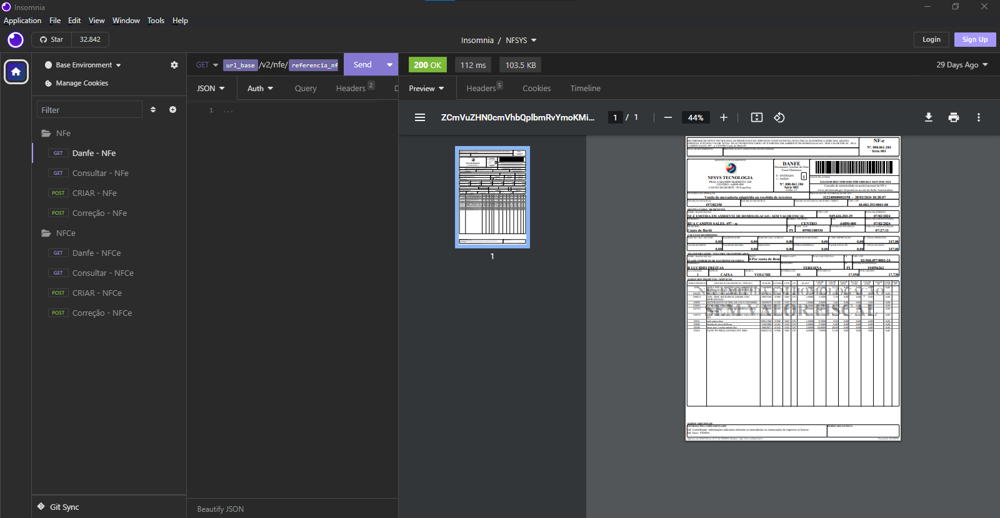
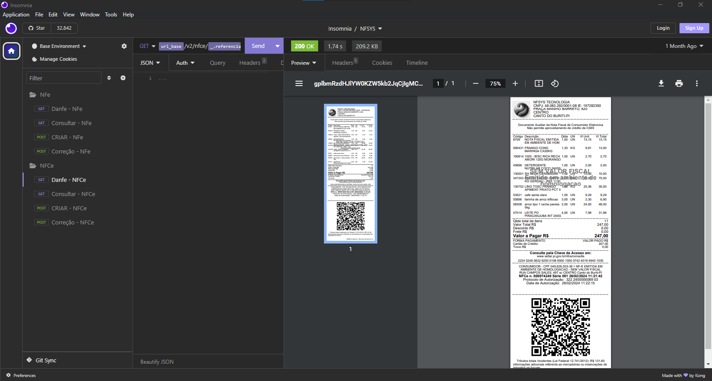

# API PARA EMITIR NFE E NFCE EM HOMOLOGAÇÃO

## Freelancer, Esse projeto é uma api para emitir nfe e nfce. Feito em PHP usando recursos modernos da linguagem. Foi usado como dependência a NfePHP.

